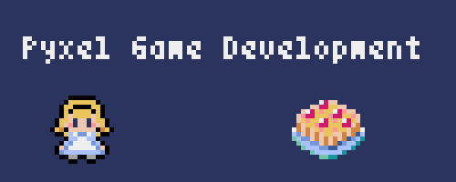
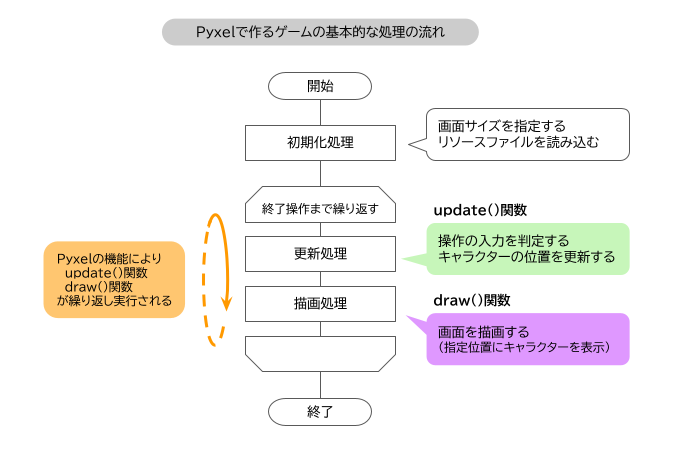

# Pyxel Game Development
  
Python向けレトロゲームエンジン Pyxel を使用したゲーム作成の情報  
[ブログ記事（Pyxelゲーム作成の記事一覧）](https://kinutani.hateblo.jp/entry/2022/12/15/184811)  
  
## Pyxelゲームの処理の基本
  
Pyxelのゲームの処理の流れは基本的に「初期化処理を最初に行い，その後は update() と draw() を実行し続ける」になります。この流れを頭に入れてゲーム作成を行いましょう。  

## ブログ記事で紹介したプログラム  
| No. | ソースコード | 内容 |記事|
|:---:|:---:|:---|:---:|
| 1 | [じゃんけんゲーム](pyxel/rps_game/) | クリック位置の取得 | [](https://kinutani.hateblo.jp/entry/2022/10/29/155359) |  
| 2 | [アクションゲーム1](pyxel/ninja/) | 忍者のキャラクターをジャンプさせます。<br>タイルマップの使用 | [](https://kinutani.hateblo.jp/entry/2022/11/27/092216) |  
| 3 | [アクションゲーム2](pyxel/penguinjump/) | ペンギンのキャラクターがステージクリアを目指します。<br>画面スクロール，ゲームの進行管理 | [](https://kinutani.hateblo.jp/entry/2022/12/25/162239) |  
| 4 | [三目並べ](pyxel/TicTacToe/) | クラスを使ったプログラム | [](https://kinutani.hateblo.jp/entry/2023/01/09/220920) |  
| 5 | [シューティングゲーム](pyxel/shooter_r/) | 公式サンプルプログラムを横方向のSTGに改造します | [](https://kinutani.hateblo.jp/entry/2023/01/15/155601) |  
| 6 | [迷路ゲーム1](pyxel/maze/) | ウサギロボがお化けを避けてゴールを目指します<br>上下左右移動のアニメーション（クラス未使用版） | [](https://blog.hatena.ne.jp/kinutani/kinutani.hateblo.jp/edit?entry=4207112889968552854) |  
| 7 | [迷路ゲーム2](pyxel/maze_random/) | アリスが迷路のゴールを目指します<br>迷路の自動生成　2点間の距離を調べる | [](https://kinutani.hateblo.jp/entry/2023/03/10/222546) |  
| 8 | [日本語表示例](pyxel/bmpfont/) | ビットマップフォントの表示 | [](https://kinutani.hateblo.jp/entry/2023/03/22/185042) |  

  
## コマンド抜粋
| コマンド | 内容 |
|:---|:---|
| `pip install -U pyxel` | Windows Pyxelのインストール（アップデート） |
| `pyxel copy_examples` | サンプルコードコピー |
| `pyxel edit filename` | Pyxel Editor の起動 |
| `pyxel package appdir srcname` | Pyxel アプリケーションファイル (.pyxapp) 作成 |
| `pyxel app2html your_app.pyxapp` | Pyxel アプリを HTML ファイルに変換する |
| `python -m http.server` | PythonのWebサーバー起動<br>http://localhost:8000/test.html のようにアクセス |

  
## ひな形等

### プログラムテンプレート
| No. | リンク | 内容 |
|:---:|:---:|:---|
| 1 | [Appクラスのひな形](template/01_main.py) | Appクラスのコード |  
| 2 | [テストプログラム用](template/01a_simple.py) | クラスなし簡易版 |  
| 3 | [スクリーンショット用](template/02_screenshot.py) | show()で1回だけ表示 |  
| 4 | [イメージバンク画像出力](template/02a_savepng.py) | イメージバンクをPNGファイルで出力 |  
| 5 | [GIFアニメーションファイル用](template/03_animation.py) | flip()で表示ループ |  

  
### APIコード例
- [システム](docs/api_system.md#システム)  , [リソース](docs/api_system.md#リソース) , [入力](docs/api_system.md#入力)  
- [グラフィックス](docs/api_graphics.md#グラフィックス) , [イメージクラス](docs/api_graphics.md#イメージクラス) , [タイルマップクラス](docs/api_graphics.md#タイルマップクラス)   
- [オーディオ](api_audio.md#オーディオ) , [サウンドクラス](api_audio.md#サウンドクラス) , [ミュージッククラス](api_audio.md#ミュージッククラス)     
  
  
  
### コード部品
乱数（整数）  
``` python
pyxel.rndi(1,100)
```
マウスカーソル表示  
``` python
pyxel.mouse(True)
```
マウス座標取得
``` python
x = pyxel.mouse_x
y = pyxel.mouse_y
```
方向キー入力 （[キー記述例](docs/api_system.md#キー記述例)  ）
``` python
if pyxel.btn(pyxel.KEY_UP) or pyxel.btn(pyxel.GAMEPAD1_BUTTON_DPAD_UP):

if pyxel.btn(pyxel.KEY_DOWN) or pyxel.btn(pyxel.GAMEPAD1_BUTTON_DPAD_DOWN):

if pyxel.btn(pyxel.KEY_LEFT) or pyxel.btn(pyxel.GAMEPAD1_BUTTON_DPAD_LEFT):

if pyxel.btn(pyxel.KEY_RIGHT) or pyxel.btn(pyxel.GAMEPAD1_BUTTON_DPAD_RIGHT):
```
``` python
if pyxel.btn(pyxel.KEY_W) or pyxel.btn(pyxel.GAMEPAD1_BUTTON_DPAD_UP):

if pyxel.btn(pyxel.KEY_S) or pyxel.btn(pyxel.GAMEPAD1_BUTTON_DPAD_DOWN):

if pyxel.btn(pyxel.KEY_A) or pyxel.btn(pyxel.GAMEPAD1_BUTTON_DPAD_LEFT):

if pyxel.btn(pyxel.KEY_D) or pyxel.btn(pyxel.GAMEPAD1_BUTTON_DPAD_RIGHT):
```
スペースキー入力  
``` python
if pyxel.btnp(pyxel.KEY_SPACE) or pyxel.btnp(pyxel.GAMEPAD1_BUTTON_A):
```
``` python
if pyxel.btnp(pyxel.KEY_SPACE,15,15) or pyxel.btnp(pyxel.GAMEPAD1_BUTTON_A,15,15):
```
マウスクリック
``` python
if pyxel.btnp(pyxel.MOUSE_BUTTON_LEFT) or pyxel.btnp(pyxel.GAMEPAD1_BUTTON_A):
```
タイルマップ取得，設定  
``` python
xidx = 1 //8
yidx = 1 //8
tile = pyxel.tilemap(0).pget(xidx,yidx)
pyxel.tilemap(0).pset(xidx,yidx, (1,0) )
```
タイルマップ表示  
``` python
pyxel.camera()
pyxel.bltm(0,0, 0, self.scroll_x,self.scroll_y, pyxel.width,pyxel.height, 0)
pyxel.camera(self.scroll_x,self.scroll_y)
```
イメージ表示  
``` python
pyxel.blt(self.x, self.y, 0, u,v, self.w, self.h, 0)
```
効果音再生  
``` python
pyxel.play(ch,sNo)
```
BGM再生・停止  
``` python
pyxel.playm(msc, loop=True)
pyxel.stop(ch)
```
#### ゲーム進行例
シーン番号  
``` python
SNO_TITLE    = 0
SNO_STAGESET = 10
SNO_PLAY     = 11
SNO_SFINISH  = 12
SNO_GAMEOVER = 13
SNO_END      = 20
```
シーン分岐  
``` python
if SNO_TITLE == self.scene:
    pass
elif SNO_STAGESET == self.scene:
    pass
elif SNO_PLAY == self.scene:
    pass
elif SNO_SFINISH == self.scene:
    pass
elif SNO_GAMEOVER == self.scene:
    pass
elif SNO_END == self.scene:
    pass
else:
    pass
```


# Author
E-mail benkyoubox@gmail.com  


