# Pyxel API sample

グラフィックス，イメージクラス，タイルマップクラス，フォントクラス  
バージョン：Pyxel 2.2版  
  
## contents


| 分類 | 項目 |
|:---:|:---|
|[システム](api_system.md#システム)| [変数](api_system.md#variable) [init()](api_system.md#init) [run()](api_system.md#run) [show()](api_system.md#show) [flip()](api_system.md#flip) [quit()](api_system.md#quit)|
|[リソース](api_system.md#リソース)| [load()](api_system.md#load) [save()](api_system.md#save)  |
|[入力](api_system.md#入力)| [変数](api_system.md#variable-1) [btn()](api_system.md#btn) [btnp()](api_system.md#btnp) [btnr()](api_system.md#btnr) [mouse()](api_system.md#mouse) [キー記述例](api_system.md#keycode) |  
|[グラフィックス](api_graphics.md#グラフィックス)| [変数](api_graphics.md#variable) [image()](api_graphics.md#image) [tilemap()](api_graphics.md#tilemap) [clip()](api_graphics.md#clip) [camera()](api_graphics.md#camera) [pal()](api_graphics.md#pal) [dither()](api_graphics.md#dither) [cls()](api_graphics.md#cls) [pget()](api_graphics.md#pget) [pset()](api_graphics.md#pset) <br> [line()](api_graphics.md#line) [rect()](api_graphics.md#rect) [rectb()](api_graphics.md#rectb) [circ()](api_graphics.md#circ) [circb()](api_graphics.md#circb) [elli()](api_graphics.md#elli) [ellib()](api_graphics.md#ellib) [tri()](api_graphics.md#tri) [trib()](api_graphics.md#trib) <br> [fill()](api_graphics.md#fill) [blt()](api_graphics.md#blt) [bltm()](api_graphics.md#bltm) [text()](api_graphics.md#text) [表示色](api_graphics.md#color) |
|[イメージクラス](api_graphics.md#イメージクラス)| [変数](api_graphics.md#variable-1) [from_image()](api_graphics.md#from_image) [data_ptr()](api_graphics.md#data_ptr) [set()](api_graphics.md#set) [load()](api_graphics.md#load) [save()](api_graphics.md#save) [pget()](api_graphics.md#pget-1) [pset()](api_graphics.md#pset-1) |
|[タイルマップクラス](api_graphics.md#タイルマップクラス)| [変数](api_graphics.md#variable-2)  [set()](api_graphics.md#set-1) [pget()](api_graphics.md#pget-2) [pset()](api_graphics.md#pset-2) |
|[フォントクラス](api_graphics.md#フォントクラス)| [Font()](api_graphics.md#font) [text_width()](api_graphics.md#text_width) |
|[オーディオ](api_audio.md#オーディオ)| [sound()](api_audio.md#sound) [music()](api_audio.md#music) [play_pos()](api_audio.md#play_pos) [play()](api_audio.md#play) [playm()](api_audio.md#playm) [stop()](api_audio.md#stop) |
|[サウンドクラス](api_audio.md#サウンドクラス)| [変数](api_audio.md#variable) [set()](api_audio.md#set) [set_notes()](api_audio.md#set_notes) [set_tones()](api_audio.md#set_tones) [set_volumes()](api_audio.md#set_volumes) [set_effects()](api_audio.md#set_effects) |
|[ミュージッククラス](api_audio.md#ミュージッククラス)| [変数](api_audio.md#variable-1) [set()](api_audio.md#set-1) |
|[数学](api_math.md#pyxel-api-sample)| [ceil()](api_math.md#ceil) [floor()](api_math.md#floor) [sgn()](api_math.md#sgn) [sqrt()](api_math.md#sqrt) [sin()](api_math.md#sin) [cos()](api_math.md#cos) [atan2()](api_math.md#atan2) [rseed()](api_math.md#rseed) [rndi()](api_math.md#rndi) [rndf()](api_math.md#rndf) [nseed()](api_math.md#nseed) [noise()](api_math.md#noise) |


<br>
  
- [Pyxel APIリファレンス](https://github.com/kitao/pyxel/blob/main//docs/README.ja.md) のAPI実行例です。  

<br>

- 公式サンプルは以下を参照してください。<br>

| デモ | コード | 内容 |
|:---:|:---|:---|
| [Web](https://kitao.github.io/pyxel/wasm/examples/03_draw_api.html) | [03_draw_api.py](https://github.com/kitao/pyxel/blob/main/python/pyxel/examples/03_draw_api.py) | 描画 API のデモ |
| [Web](https://kitao.github.io/pyxel/wasm/examples/08_triangle_api.html) | [08_triangle_api.py](https://github.com/kitao/pyxel/blob/main/python/pyxel/examples/08_triangle_api.py) | 三角形描画 API のデモ |
| [Web](https://kitao.github.io/pyxel/wasm/examples/11_offscreen.html) | [11_offscreen.py]() | Image クラスによるオフスクリーン描画 <br> 縁取りや拡大などイメージバンク上で描画してから画面表示 |
| [Web](https://kitao.github.io/pyxel/wasm/examples/13_bitmap_font.html) | [13_bitmap_font.py](https://github.com/kitao/pyxel/blob/main/python/pyxel/examples/13_bitmap_font.py) | ビットマップフォント描画 <br> 日本語表示，文字の縁取り処理など |
| [Web](https://kitao.github.io/pyxel/wasm/examples/15_tiled_map_file.html) | [15_tiled_map_file.py](https://github.com/kitao/pyxel/blob/main/python/pyxel/examples/15_tiled_map_file.py) | タイルマップファイル (.tmx) の読み込みと描画 |
| [Web](https://kitao.github.io/pyxel/wasm/examples/16_transform.html) | [16_transform.py](https://github.com/kitao/pyxel/blob/main/python/pyxel/examples/16_transform.py) | 画像の回転と拡大縮小，半透明処理 |

<br>

- コード例で使用しているリソースファイル（[sample.pyxres](https://github.com/kitao/pyxel/blob/main/python/pyxel/examples/assets/sample.pyxres)）は公式サイトからDownloadできます。

<br>
  
## グラフィックス  
<br>  


### variable  


|変数名|型|説明|記述例|
|:---:|:---:|:---|:---|
| colors | リスト | パレットの表示色リスト。<br>表示色は 24 ビット数値(0x000000-0xffffff)で指定します。 | pyxel.colors |  

<br>

``` python
pyxel.colors[3] = 0x19C5FA    # 表示色3を薄い青色に変更
pyxel.cls(3)
```
・Python リストを直接代入、取得する場合はcolors.from_listとcolors.to_listを使用してください。
``` python
# デフォルトのカラーパレットを退避
org_colors = pyxel.colors.to_list()

# デフォルトのカラーパレットで復帰
pyxel.colors.from_list(org_colors)
```
<br>

命令の引数など通常（pyxel.colors以外）は，色の番号で指定します。  
  

<br>  

### image()
  イメージバンクimg (0-2) を操作します。([イメージクラス](#イメージクラス)を参照のこと)  
  `image(img)`  

| 引数 | 型 | 説明 |
|:---:|:---:|:---|
| img | u32 | 操作対象のイメージバンク (0-2) |
  
<br>

| 戻り値 | 型 | 説明 |
|:---:|:---:|:---|  
| イメージバンク | Image | 指定したイメージバンクのオブジェクト |  

<br>

【参考】イメージバンクに描画する例  
``` python
import pyxel
pyxel.init(64, 64)

pyxel.cls(1)
pyxel.image(0).text(0,0,"Image",7)  # img 0 にテキストを描画
pyxel.blt(10,10, 0, 0,0, 20,8, 0)   # img 0 の指定範囲を画面に表示

pyxel.show()
```
> __Note__  
画面にテキストを表示する場合，通常は [pyxel.text()](#text) を用います。  
この例はイメージバンクの絵を変更する特殊な例で，以下のような用途で使えそうです。  
・ ゲーム中にキャラクタの見た目を変える  
・ マップウィンドウなどをメイン画面と別にイメージバンクに作ってから画面に表示する  
詳しくは [オフスクリーン描画の公式サンプル](https://github.com/kitao/pyxel/blob/main/python/pyxel/examples/11_offscreen.py) を参照してください。  

<br>
  
### tilemap()  
  タイルマップtm (0-7) を操作します。([タイルマップクラス](#タイルマップクラス)を参照のこと)  
  `tilemap(tm)`  

| 引数 | 型 | 説明 |
|:---:|:---:|:---|
| tm | u32 | 操作対象のタイルマップ (0-7) |
  
<br>

| 戻り値 | 型 | 説明 |
|:---:|:---:|:---|  
| タイルマップ | Tilemap | 指定したタイルマップのオブジェクト |  


<br>

### clip()  
  画面の描画領域を (x, y) から幅w、高さhに設定します。clip()で描画領域を全画面にリセットします。    
  `clip(x, y, w, h)`  

| 引数 | 型 | 説明 |
|:---:|:---:|:---|
| x | f64 | 左上座標 |
| y | f64 | 左上座標 |
| w | f64 | 幅 |
| h | f64 | 高さ |

<br>

``` python
import pyxel
pyxel.init(64, 64)
pyxel.mouse(True)

def update():
    return

def draw():
    pyxel.cls(1)
    pyxel.rectb(2,2,60,60,10)
    pyxel.text(8,28,"Hello world!",7)
    pyxel.clip(pyxel.mouse_x,pyxel.mouse_y, 32,32)
    return

pyxel.run(update, draw)
```
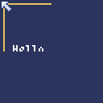  
<br>
  
### camera()  
  画面の左上隅の座標を (x, y) に変更します。camera()で左上隅の座標を (0, 0) にリセットします。  
  `camera(x, y)`

| 引数 | 型 | 説明 |
|:---:|:---:|:---|
| x | f64 | 左上座標 |
| y | f64 | 左上座標 | 

<br>

``` python
import pyxel
pyxel.init(64, 64)

def update():
    return

def draw():
    pyxel.cls(1)
    pyxel.camera(-5,-5)
    pyxel.rectb(2,2,60,60,10)
    pyxel.text(8,28,"Hello world!",7)
    return

pyxel.run(update, draw)
```
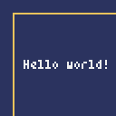  
<br>
  
### pal()  
  描画時に色col1をcol2に置き換えます。pal()で初期状態にリセットします。  
  `pal(col1, col2)`

| 引数 | 型 | 説明 |
|:---:|:---:|:---|
| col1 | u8 | 置き換え対象の色 (0-15)  |  
| col2 | u8 | 置き換える色 (0-15)  |  

<br>

``` python
import pyxel
pyxel.init(64, 64)

flg = False
def update():
    global flg
    if pyxel.btnp(pyxel.MOUSE_BUTTON_LEFT):
        flg = not(flg)
    return

def draw():
    pyxel.cls(1)
    pyxel.rectb(2,2,60,60,10)
    pyxel.text(8,28,"Hello world!",7)
    if flg:
        pyxel.pal(1,7)
        pyxel.pal(7,1)
    else:
        pyxel.pal()
    return

pyxel.run(update, draw)
```
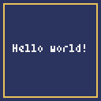   

<br>

<br>

### dither()  
  以降の描画命令にディザリングを追加して半透明にします。（上級者向けAPI）   
  `dither(alpha)`  

| 引数 | 型 | 説明 |
|:---:|:---:|:---|
| alpha | f32 | 透明度（0.0 透明 ～ 1.0 不透明） |  

<br>

``` python
import pyxel
pyxel.init(160, 110, fps=3)
pyxel.image(0).load(0, 0, "g_load_3.png",incl_colors=True)

alpha = 1.0
def update():
    global alpha
    if alpha < 1.0 :
        alpha += 0.1
    else :
        alpha = 0.0
    return

def draw():
    pyxel.cls(1)
    pyxel.text(1,16,"dither sample", 7) # 背面のテキスト
    pyxel.dither(alpha) # ディザリング
    pyxel.blt(0,10, 0, 0,0, 160, 100)
    pyxel.dither(1.0) # ディザリングなしで文字を描画
    pyxel.text(1,1,"alpha "+str(alpha), 7)
    return

pyxel.run(update, draw)
```

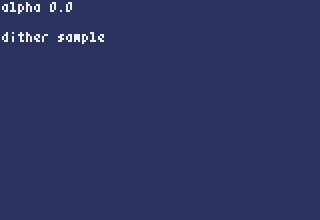  コード例で読み込んだファイル [g_load_3.png](https://github.com/benkyoubox/game/blob/main/docs/images/api/g_load_3.png)   

<br>

### cls()  
  画面を色colでクリアします。  
  `cls(col)`  

| 引数 | 型 | 説明 |
|:---:|:---:|:---|
| col | u8 | 画面を塗りつぶす色 (0-15)  |  

<br>

``` python
pyxel.cls(0)
```
<br>

[表示色](api_graphics.md#color)   

<br>

### pget()  
  画面上 (x, y) のピクセルの色を取得します。  
  `pget(x, y)`  

| 引数 | 型 | 説明 |
|:---:|:---:|:---|
| x | f64 | x座標 |  
| y | f64 | y座標 |  
  
<br>

| 戻り値 | 型 | 説明 |
|:---:|:---:|:---|  
| col | u8 | ピクセルの色 (0-15) |  

<br>

``` python
import pyxel
pyxel.init(64, 64)

col = 0
def update():
    global col
    col = pyxel.pget(pyxel.mouse_x, pyxel.mouse_y)
    return

def draw():
    pyxel.cls(1)
    for i in range(16):
        pyxel.rect(4*i,0,4,40,i)
    pyxel.text(8,48,"col="+str(col),7)
    return

pyxel.run(update, draw)
```
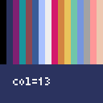  
<br>
  
### pset()  
  (x, y) に色colのピクセルを描画します。  
  `pset(x, y, col)`  

| 引数 | 型 | 説明 |
|:---:|:---:|:---|
| x | f64 | x座標 |  
| y | f64 | y座標 |  
| col | u8 | 描画色 (0-15)  |  

<br>

``` python
import pyxel
pyxel.init(64, 64)

def update():
    return

def draw():
    #pyxel.cls(0)
    pyxel.pset(pyxel.mouse_x, pyxel.mouse_y,pyxel.rndi(1,15))
    return

pyxel.run(update, draw)
```
  

<br>

[表示色](api_graphics.md#color)   

<br>

### line()  
  色colの直線を (x1, y1)-(x2, y2) に描画します。    
  `line(x1, y1, x2, y2, col)`  

### rect()  
  幅w、高さh、色colの矩形を (x, y) に描画します。※矩形（くけい）は長方形  
  `rect(x, y, w, h, col)`  

### rectb()  
  幅w、高さh、色colの矩形の輪郭線を (x, y) に描画します。  
  `rectb(x, y, w, h, col)`  

### circ()  
  半径r、色colの円を (x, y) に描画します。  
  `circ(x, y, r, col)`  

### circb()  
  半径r、色colの円の輪郭線を (x, y) に描画します。  
  `circb(x, y, r, col)`  

### elli()  
  幅w、高さh、色colの楕円を (x, y) に描画します。  
  `elli(x, y, w, h, col)`  

### ellib()  
  幅w、高さh、色colの楕円の輪郭線を (x, y) に描画します。  
  `ellib(x, y, w, h, col)`  

### tri()  
  頂点が (x1, y1)、(x2, y2)、(x3, y3)、色colの三角形を描画します。  
  `tri(x1, y1, x2, y2, x3, y3, col)`  

### trib()  
  頂点が (x1, y1)、(x2, y2)、(x3, y3)、色colの三角形の輪郭線を描画します。  
  `trib(x1, y1, x2, y2, x3, y3, col)`  

<br>

[表示色](api_graphics.md#color)   

<br>

``` python
import pyxel
pyxel.init(128, 128)

def update():
    return

def draw():
    pyxel.cls(0)
    # 線
    pyxel.line(4,4, 64,4, 3)
    # 長方形
    pyxel.rect(2,8, 24,16, 4)
    pyxel.rectb(42,8, 24,16, 5)
    # 円
    pyxel.circ(12,38, 8, 6)
    pyxel.circb(50,38, 8, 7)
    # 楕円
    pyxel.elli(2,54, 24,16, 8)
    pyxel.ellib(42,54, 24,16, 9)
    # 三角形
    pyxel.tri(2,100, 22,100, 12,80, 10)
    pyxel.trib(42,100, 62,100, 52,80, 11)
    return

pyxel.run(update, draw)
```
<br>
  
### fill()  
  (x, y) と同じ色でつながっている領域を色colで塗りつぶします。  
  `fill(x, y, col)`  

| 引数 | 型 | 説明 |
|:---:|:---:|:---|
| x | f64 | x座標 |  
| y | f64 | y座標 |  
| col | u8 | 塗りつぶし色 (0-15)  |  

<br>


``` python
import pyxel
pyxel.init(64, 64)
pyxel.mouse(True)

def update():
    return

def draw():
    pyxel.cls(0)
    pyxel.rectb(2,2, 50,50, 7)
    pyxel.circb(40,20, 18, 7)
    pyxel.tri(10,60, 60,60, 60,40, 7)
    pyxel.fill(pyxel.mouse_x, pyxel.mouse_y, 10)
    return

pyxel.run(update, draw)
```
   

<br>

[表示色](api_graphics.md#color)   

<br>

### blt()  
  イメージバンクimg (0-2) の (u, v) からサイズ (w, h) の領域を (x, y) にコピーします。w、hそれぞれに負の値を設定すると水平、垂直方向に反転します。colkeyに色を指定すると透明色として扱われます。  
  `blt(x, y, img, u, v, w, h, [colkey], [rotate], [scale])`  

| 引数 | 型 | 説明 |
|:---:|:---:|:---|
| x | f64 | 描画先のx座標 |  
| y | f64 | 描画先のy座標 |  
| img | u32 | イメージバンク (0-2) |  
| u | f64 | ドット絵の座標 |  
| v | f64 | ドット絵の座標 |  
| w | f64 | ドット絵の幅（マイナスで左右反転） |  
| h | f64 | ドット絵の高さ（マイナスで上下反転） |  
| colkey | u8 | 透明色 (0-15)  （[表示色](api_graphics.md#color)） | 
| rotate | f64 | 回転角度（時計回り *1） |
| scale | f64 | 拡大率 |  

 *1 回転方向について v2.3.6 で反時計回りから時計回りに変更になりました。
<br>

``` python
import pyxel
pyxel.init(42, 12)
pyxel.load("sample.pyxres")

def update():
    return

def draw():
    pyxel.cls(3)
    pyxel.blt(2,2, 0, 8,0, 8,8)
    pyxel.blt(12,2, 0, 8,0, 8,8, 0)
    pyxel.blt(22,2, 0, 8,0, -8,8, 0)
    pyxel.blt(32,2, 0, 8,0, 8,-8, 0)
    return

pyxel.run(update, draw)
```
  

<br>

回転表示の例（詳しくは公式サンプル [16_transform.py](https://github.com/kitao/pyxel/blob/main/python/pyxel/examples/16_transform.py) 参照）

``` python
import pyxel
pyxel.init(124, 24)
pyxel.load("sample.pyxres")

def update():
    return

def draw():
    pyxel.cls(3)
    pyxel.rectb(2,2,120,8,0)
    for i in range(11):
        pyxel.blt(2+i*10,2, 0, 8,0, 8,8, 0, rotate=i*36 )
        if i % 2 == 0:
            pyxel.text(2+i*10,12,str(i*36),7)
    return

pyxel.run(update, draw)
```
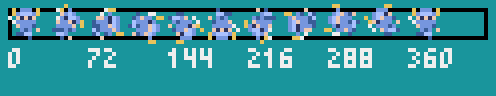  

<br>

拡大縮小表示の例（詳しくは公式サンプル [16_transform.py](https://github.com/kitao/pyxel/blob/main/python/pyxel/examples/16_transform.py) 参照）

``` python
import pyxel
pyxel.init(124, 32)
pyxel.load("sample.pyxres")

def update():
    return

def draw():
    pyxel.cls(3)
    for i in range(1,6):
        pyxel.blt(i*20,12, 0, 8,0, 8,8, 0, scale=i*0.5 )
        pyxel.text(i*20,2,str(i*0.5),7)
        pyxel.rectb(i*20,12, 8,8, 0)
    return

pyxel.run(update, draw)
```
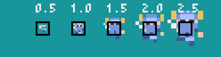  


<br>
  
### bltm()  
  タイルマップtm (0-7) の (u, v) からサイズ (w, h) の領域を (x, y) にコピーします。w、hそれぞれに負の値を設定すると水平、垂直方向に反転します。colkeyに色を指定すると透明色として扱われます。1 タイルのサイズは 8x8 ピクセルで、(tile_x, tile_y)のタプルとしてタイルマップに格納されています。  
  `bltm(x, y, tm, u, v, w, h, [colkey])`  

| 引数 | 型 | 説明 |
|:---:|:---:|:---|
| x | f64 | 描画先のx座標 |  
| y | f64 | 描画先のy座標 |  
| tm | u32 | タイルマップ (0-7) |  
| u | f64 | タイルマップの座標（ピクセル単位） |  
| v | f64 | タイルマップの座標（ピクセル単位） |  
| w | f64 | タイルマップの幅（ピクセル単位　マイナスで左右反転） |  
| h | f64 | タイルマップ高さ（ピクセル単位　マイナスで上下反転） |  
| colkey | u8 | 透明色 (0-15)  （[表示色](api_graphics.md#color)） | 
| rotate | f64 | 回転角度（時計回り *1） |
| scale | f64 | 拡大率 |  

*1 回転方向について v2.3.6 で反時計回りから時計回りに変更になりました。
<br>

``` python
pyxel.bltm(0,0, 0, 0,0, 128,128, 0)
```
``` python
pyxel.camera()
pyxel.bltm(0,0, 0, self.scroll_x,self.scroll_y, pyxel.width,pyxel.height, 0)
pyxel.camera(self.scroll_x,self.scroll_y)
```
``` python
import pyxel
pyxel.init(42, 12)
pyxel.load("sample.pyxres")

def update():
    return

def draw():
    pyxel.cls(3)
    pyxel.bltm(2,2, 0, 8,0, 8,8)
    pyxel.bltm(12,2, 0, 8,0, 8,8, 0)
    pyxel.bltm(22,2, 0, 8,0, -8,8, 0)
    pyxel.bltm(32,2, 0, 8,0, 8,-8, 0)
    return

pyxel.run(update, draw)
```
``` python
import pyxel
pyxel.init(42, 24)
pyxel.load("sample.pyxres")

def update():
    return

def draw():
    pyxel.cls(3)
    pyxel.bltm(2,4, 0, 8,0, 8,8, 0)
    pyxel.bltm(12,4, 0, 8,0, 8,8, 0, rotate=90)
    pyxel.bltm(26,4, 0, 8,0, 8,8, 0, scale=2)
    pyxel.rectb(26,4, 8,8, 0)
    return

pyxel.run(update, draw)
```
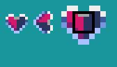  

<br>
  
### text()  
  色colの文字列sを (x, y) に描画します。  
  `text(x, y, s, col)` 　　　　 # 半角英数文字列を表示  
  `text(x, y, s, col, font)` 　# 日本語の文字列を表示  

| 引数 | 型 | 説明 |
|:---:|:---:|:---|
| x | f64 | 描画先のx座標 |  
| y | f64 | 描画先のy座標 | 
| s | str | 文字列（半角英数） |
| col | u8 | 文字色 (0-15)  |
| font | Font | 省略可 <br> フォントクラスを使用した日本語表示例は [フォントクラス](#フォントクラス) 参照 |  

<br>


``` python
pyxel.text(4, 4, "Hello, Pyxel!", pyxel.frame_count % 16)
```

<br>

[表示色](api_graphics.md#color)   

<br>

[ページの先頭に戻る](#pyxel-api-sample)　


## イメージクラス
<br>


### variable  


|変数名|型|説明|記述例|
|:---:|:---:|:---|:---|
| width | u32 | イメージの幅 | `pyxel.image(0).width` |
| height | u32 | イメージの高さ | `pyxel.image(0).height` |
<br>

``` python
print(pyxel.image(0).width)   # 256
print(pyxel.image(0).height)  # 256
```
<br>
  
### from_image()  
  画像ファイルを読み込んでイメージクラスを作成します。   
  `from_image(filename, [incl_colors])`  

| 引数 | 型 | 説明 |
|:---:|:---:|:---|
| filename | str | 画像ファイルパス |  
| incl_colors | bool | 省略時 Falseと同じ <br> True 画像ファイルの色も読み込む <br> False 現在のカラーパレットで読み込む | 

| 戻り値 | 型 | 説明 |
|:---:|:---:|:---|  
| img | Image | イメージクラス |  
<br>

``` python
pyxel.images[0] = pyxel.Image.from_image( "col.png", incl_colors=True )
```
カラーパレットはイメージバンク0-2で共通です。（色も読み込むについては [load()](#load) を参照してください）  
<br>

### data_ptr()  
  画像メモリへアクセスするリストを返します。（上級者向けAPI）  
  `data_ptr()`  

``` python
import pyxel
pyxel.init(64, 64)
screen_ptr = pyxel.screen.data_ptr()
color = 0
for j in range(pyxel.height):
    for i in range(pyxel.width):
        screen_ptr[  j * pyxel.width +  i  ] = color % 16
        color += 1

pyxel.show()
```

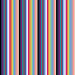  

> __Note__  
data_ptr()を使用した画面効果については[ブログ記事](https://kinutani.hateblo.jp/entry/2023/03/30/165436)も参照してください。  

<br>

### set()  
  (x, y) に文字列のリストでイメージを設定します。  
  `set(x, y, data)`  

| 引数 | 型 | 説明 |
|:---:|:---:|:---|
| x | i32 | イメージバンクの座標 |  
| y | i32 | イメージバンクの座標 |  
| data | リスト | ["1行目データ","2行目データ",・・・]<br>ドットの色を16進の文字で指定 |  

<br>

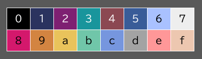  ※ 10-15 を a-f で表す  

<br>

``` python
import pyxel
pyxel.init(32, 32)

data = ["bbbb",
        "b77b",
        "b77b",
        "3333"]
pyxel.image(0).set(0,0, data)

def update():
    return

def draw():
    pyxel.cls(0)
    pyxel.blt(4,8, 0, 0,0, 4,4, 0)
    return

pyxel.run(update, draw)
```
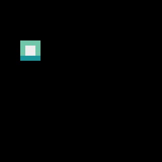  
<br>
  
### load()  
  (x, y) に画像ファイル (png/gif/jpeg) を読み込みます。  
  `load(x, y, filename)` 　　　　　　　　# 現在のカラーパレットで読み込み  
  `load(x, y, filename, incl_colors)` 　# 画像ファイルからカラーパレットを作成 

| 引数 | 型 | 説明 |
|:---:|:---:|:---|
| x | i32 | イメージバンクの座標 |  
| y | i32 | イメージバンクの座標 |  
| filename | str | 画像ファイル名 (png/gif/jpeg) |  
| incl_colors | bool | 省略時 Falseと同じ <br> True 画像ファイルの色も読み込む <br> False 現在のカラーパレットで読み込む |  

<br>

``` python
pyxel.image(2).load(0, 0, "penguin.png")    # イメージバンク2に画像ファイルを読み込む例
```

<br>

> __Note__  
カラーパレットはイメージバンク0-2で共通です。  
現在のカラーパレットで読み込む場合は，フルカラーのファイルを読み込んで色の置換が可能です。  
ファイルの色も読み込む場合は，256色でエラーになるため，元ファイルを減色しておく必要があります。  
画像ファイルからのカラーパレット作成について （カラーパレットの拡張については[ブログ記事](https://kinutani.hateblo.jp/entry/2024/04/26/235010)も参照してください）  

読み込み元のファイル  
  

(1) 現在のカラーパレットで読み込むと，パレット内の近似色に置換される  
``` python
pyxel.image(0).load(0, 0, "g_load_0.png",incl_colors=False) # 現在のカラーパレットで読み込む
pyxel.cls(0)
pyxel.blt(0,10, 0, 0,0, 160, 100)
pyxel.text(1,1,"incl_colors = False", 7)
```
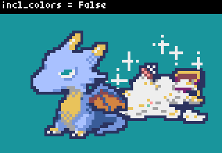 色は自動的に変換  

(2) 画像ファイルの色も読み込むと，ファイルの色でパレットが再作成される  
``` python
pyxel.image(0).load(0, 0, "g_load_0.png",incl_colors=True) # 色も読み込む
pyxel.cls(0) # 0番の色で塗りつぶし
pyxel.blt(0,10, 0, 0,0, 160, 100)
pyxel.text(1,1,"incl_colors = True", 7) # 文字色は7番
```
 0番や7番の色もファイルの色になる  

(3) 読み込み元のファイルにデフォルトカラーパレットの色を追加した例  
 左上から色が読まれるので，カラーパレットを先に設定    

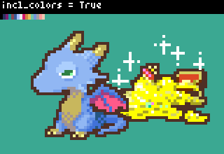 0番や7番の色を保持  


<br>

### save()  
  指定したイメージバンクをPNGファイルに出力する。（上級者向けAPI）  
  `save(filename, scale)`

| 引数 | 型 | 説明 |
|:---:|:---:|:---|
| filename | str | 出力ファイル名 (.png が付加される) |  
| scale | u32 | 画像サイズの倍率 |  

<br>

``` python
pyxel.image(0).save("image_0", 1)    # イメージバンク0を等倍で出力
```

<br>

### pget()  
  イメージバンクの (x, y) のピクセルの色 (0-15) を取得します。  
  `pget(x, y)`  

| 引数 | 型 | 説明 |
|:---:|:---:|:---|
| x | f64 | イメージバンクの座標 |  
| y | f64 | イメージバンクの座標 |  
  
<br>

| 戻り値 | 型 | 説明 |
|:---:|:---:|:---|  
| col | u8 | ピクセルの色 (0-15) |  

<br>

``` python
import pyxel
pyxel.init(32, 32)
pyxel.load("sample.pyxres")

# リソースファイルのイメージバンク0の色を取得して
# 行のデータごとに16進数の文字列に変換する例
data = []
for v in range(8):
    tmpstr = ""
    for u in range(8,16):
        tmpstr += format(pyxel.image(0).pget(u, v),'x')
    data.append(tmpstr)

# 文字列データを標準出力
for row in data:
    print('"'+row+'",')

# 文字列でイメージバンク2に設定
pyxel.image(2).set(0,0,data)

def update():
    return

def draw():
    pyxel.cls(0)
    pyxel.blt(0,0, 2, 0,0, 8,8)
    return

pyxel.run(update, draw)
```
　print結果
<pre>"0a0ccc0a",
"0ac666ca",
"70f1f1f0",
"07ccccc0",
"00fccc50",
"000c5c0f",
"00556600",
"00000500",</pre>  
<br>
  
### pset()  
  イメージバンクの (x, y) に色colのピクセルを描画します。  
  `pset(x, y, col)`  

| 引数 | 型 | 説明 |
|:---:|:---:|:---|
| x | f64 | イメージバンクの座標 |  
| y | f64 | イメージバンクの座標 |  
| col | u8 | 描画色 (0-15)  |


<br>

``` python
import pyxel
pyxel.init(32, 32)
pyxel.load("sample.pyxres")
pyxel.image(0).pset(11,0, 10)
pyxel.image(0).pset(12,1, 10)
pyxel.image(0).pset(13,0, 10)

def update():
    return

def draw():
    pyxel.cls(0)
    pyxel.blt(12,2, 0, 8,0, 8,8, 0)
    return

pyxel.run(update, draw)
```

<br>

[表示色](api_graphics.md#color)    

<br>

[ページの先頭に戻る](#pyxel-api-sample)　


## タイルマップクラス  
<br>


### variable  


|変数名|型|説明|記述例|
|:---:|:---:|:---|:---|
| width | u32 | タイルマップの幅 | `pyxel.tilemap(0).width` |
| height | u32 | タイルマップの高さ | `pyxel.tilemap(0).height` |
| refimg | u32 | タイルマップが参照するイメージバンク (0-2) | `pyxel.tilemap(0).refimg` |
<br>

``` python
print(pyxel.tilemap(0).width)   # 256
print(pyxel.tilemap(0).height)  # 256
```
 
``` python
pyxel.tilemap(0).refimg = 1  # イメージバンク1を設定する例
```
・[03_draw_api.py](https://github.com/kitao/pyxel/blob/main/python/pyxel/examples/03_draw_api.py)内の切り替え例
``` python
print(pyxel.tilemap(0).refimg, pyxel.tilemap(0).image)
pyxel.tilemap(0).image = pyxel.image(1)
print(pyxel.tilemap(0).refimg, pyxel.tilemap(0).image)
```

<br>
  
### set()  
  (x, y) に文字列のリストでタイルマップを設定します。  
  `set(x, y, data)`  

| 引数 | 型 | 説明 |
|:---:|:---:|:---|
| x | i32 | タイルマップの書き込み開始位置 |  
| y | i32 | タイルマップの書き込み開始位置 |  
| data | リスト | ["1行目データ","2行目データ",・・・]<br>タイル座標を16進数で指定 |  

<br>
※APIリファレンス記載の例にあるdataの値は古い仕様のものです。 

[03_draw_api.py](https://github.com/kitao/pyxel/blob/main/python/pyxel/examples/03_draw_api.py) 内のコードを参照してください。  


``` python
import pyxel
pyxel.init(128, 128)
pyxel.load("sample.pyxres")

# タイルマップの左上4マスを下記のタイルにする例
# ( 1,0) ( 2,0) -> "0100 0200" 
# (12,0) (12,1) -> "0c00 0c01"
# 
# (tile_x,tile_y)の指定を xxyy の2オクテットで表す
# 値は16進数で範囲は0x00-0x1f
data = ["0100 0200",
        "0c00 0c01"]
pyxel.tilemap(0).set(0, 0, data)

def update():
    return

def draw():
    pyxel.cls(0)
    pyxel.bltm(0,0, 0, 0,0, 128,128)
    return

pyxel.run(update, draw)
```
<br>

### pget()  
  (x, y) のタイルを取得します。タイルは(tile_x, tile_y)のタプルです。  
  `pget(x, y)`    

| 引数 | 型 | 説明 |
|:---:|:---:|:---|
| x | f64 | タイルマップの位置 |  
| y | f64 | タイルマップの位置 |  
  
<br>

| 戻り値 | 型 | 説明 |
|:---:|:---:|:---|  
| Tile | (u8,u8) | タイル種類（イメージバンク上の位置） |  

<br>

``` python
import pyxel
pyxel.init(128, 128)
pyxel.load("sample.pyxres")
pyxel.mouse(True)

tile = (0,0)
def update():
    global tile
    xidx = pyxel.mouse_x // 8
    yidx = pyxel.mouse_y // 8
    tile = pyxel.tilemap(0).pget(xidx,yidx)
    return

def draw():
    pyxel.cls(0)
    pyxel.bltm(0,0, 0, 0,0, 128,128)
    pyxel.text(1,9, str(tile), 7)
    return

pyxel.run(update, draw)
```
<br>

> __Note__  
タイル種類，イメージバンクとタイルマップの関係については，[タイルマップ](specs_img.md#タイルマップ--tilemap-) を参照してください。  

<br>
  
### pset()  
  (x, y) にタイルを設定します。タイルは(tile_x, tile_y)のタプルです。  
  `pset(x, y, tile)`  

| 引数 | 型 | 説明 |
|:---:|:---:|:---|
| x | f64 | タイルマップの位置 |  
| y | f64 | タイルマップの位置 |  
| Tile | (u8,u8) | タイル種類（イメージバンク上の位置） |  

<br>

``` python
xidx = x // 8
yidx = y // 8
pyxel.tilemap(0).pset(xidx,yidx, (1,0) )
```
<br>


[ページの先頭に戻る](#pyxel-api-sample)　

<br>

## フォントクラス  

ビットマップフォント（BDFファイル）を用意すると [text()](#text) で日本語を含む文字列が表示できるようになります。  
BDFファイルは文字のデータをASCIIコードで定義したフォントデータで，テキストエディタで開くと中を確認できます。  
BDFファイルは公式サイトから取得(Download raw file)できます。  
サイズ10 [umplus_j10r.bdf
](https://github.com/kitao/pyxel/blob/main/python/pyxel/examples/assets/umplus_j10r.bdf)，サイズ12 
[umplus_j12r.bdf](https://github.com/kitao/pyxel/blob/main/python/pyxel/examples/assets/umplus_j12r.bdf)


### Font()
  ビットマップフォントのファイルパスを指定して，Fontクラスを作成します。  
  `Font(filename)`  

| 引数 | 型 | 説明 |
|:---:|:---:|:---|
| filename | str | ビットマップフォントのファイルパス |

<br>

``` python
import pyxel
pyxel.init(128, 128)

# ビットマップフォントの読み込み
font = pyxel.Font("umplus_j10r.bdf")

# フォントを指定してテキスト表示
pyxel.text(10,10,"日本語の表示",7,font)

pyxel.show()
```
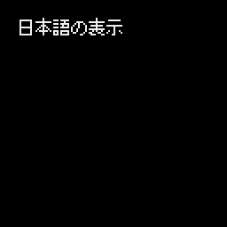  

<br>

### text_width()  
  引数で指定した文字列の表示幅を返します。  
  `Fontクラス.text_width(s)`  

| 引数 | 型 | 説明 |
|:---:|:---:|:---|
| s | str | 横幅を取得したい文字列 |

<br>

| 戻り値 | 型 | 説明 |
|:---:|:---:|:---|  
| 表示幅 | i32 | 文字列を画面に出力するときの横幅 |  

<br>

``` python
import pyxel
pyxel.init(128, 128)

# ビットマップフォントの読み込み
font = pyxel.Font("umplus_j10r.bdf")

# 表示する文字列の横幅を取得
msg = "あいうえおabcdefg"
w = font.text_width(msg)

# 文字列の背面に矩形を表示
pyxel.rect(10,10,w,10,3)

# フォントを指定してテキスト表示
pyxel.text(10,10,msg,7,font)

pyxel.show()
```

<br>

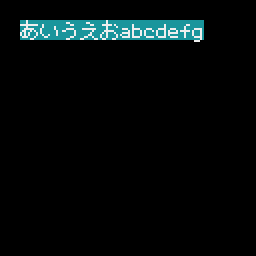  

<br>

[ページの先頭に戻る](#pyxel-api-sample)　

<br>

## color  


表示色の番号です。  
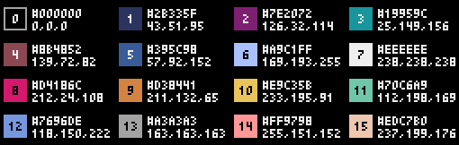  

<br>


| 番号 | 表示色 | 16進数 || 番号 | 表示色 | 16進数 |  
|---:|:---:|:---:|---|---:|:---:|:---:|  
| 0 | $\color[RGB]{0,0,0} ■(0,0,0)$ | 000000 |　| 8 | $\color[RGB]{212,24,108} ■(212,24,108)$ | d4186c |  
| 1 | $\color[RGB]{43,51,95} ■(43,51,95)$ | 2b335f |　| 9 | $\color[RGB]{211,132,65} ■(211,132,65)$ | d38441 |  
| 2 | $\color[RGB]{126,32,114} ■(126,32,114)$ | 7e2072 |　| 10 | $\color[RGB]{233,195,91} ■(233,195,91)$ | e9c35b |  
| 3 | $\color[RGB]{25,149,156} ■(25,149,156)$ | 19959c |　| 11 | $\color[RGB]{112,198,169} ■(112,198,169)$ | 70c6a9 |   
| 4 | $\color[RGB]{139,72,82} ■(139,72,82)$ | 8b4852 |　| 12 | $\color[RGB]{118,150,222} ■(118,150,222)$ | 7696de |  
| 5 | $\color[RGB]{57,92,152} ■(57,92,152)$ | 395c98 |　| 13 | $\color[RGB]{163,163,163} ■(163,163,163)$ | a3a3a3 |  
| 6 | $\color[RGB]{169,193,255} ■(69,193,255)$ | a9c1ff |　| 14 | $\color[RGB]{255,151,152} ■(255,151,152)$ | ff9798 |  
| 7 | $\color[RGB]{238,238,238} ■(238,238,238)$ | eeeeee |　| 15 | $\color[RGB]{237,199,176} ■(237,199,176)$ | edc7b0 |  


<br>


[ページの先頭に戻る](#pyxel-api-sample)　　[TOPに戻る](../README.md#pyxel-game-development)
