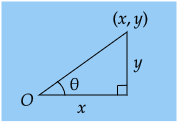
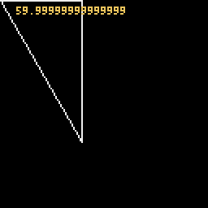
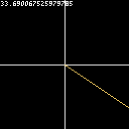
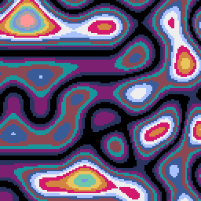
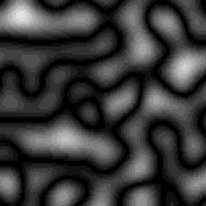
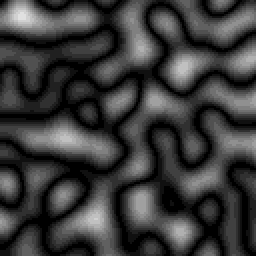
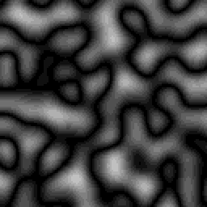

# Pyxel API sample

数学  
バージョン：Pyxel 1.9版  
  
## contents


| 分類 | 項目 |
|:---:|:---|
|[システム](api_system.md#システム)| [変数](api_system.md#variable) [init()](api_system.md#init) [run()](api_system.md#run) [show()](api_system.md#show) [flip()](api_system.md#flip) [quit()](api_system.md#quit)|
|[リソース](api_system.md#リソース)| [load()](api_system.md#load)  |
|[入力](api_system.md#入力)| [変数](api_system.md#variable-1) [btn()](api_system.md#btn) [btnp()](api_system.md#btnp) [btnr()](api_system.md#btnr) [mouse()](api_system.md#mouse) [キー記述例](api_system.md#keycode) |  
|[グラフィックス](api_graphics.md#グラフィックス)| [変数](api_graphics.md#variable) [image()](api_graphics.md#image) [tilemap()](api_graphics.md#tilemap) [clip()](api_graphics.md#clip) [camera()](api_graphics.md#camera) [pal()](api_graphics.md#pal) [cls()](api_graphics.md#cls) [pget()](api_graphics.md#pget) [pset()](api_graphics.md#pset) <br> [line()](api_graphics.md#line) [rect()](api_graphics.md#rect) [rectb()](api_graphics.md#rectb) [circ()](api_graphics.md#circ) [circb()](api_graphics.md#circb) [elli()](api_graphics.md#elli) [ellib()](api_graphics.md#ellib) [tri()](api_graphics.md#tri) [trib()](api_graphics.md#trib) <br> [fill()](api_graphics.md#fill) [blt()](api_graphics.md#blt) [bltm()](api_graphics.md#bltm) [text()](api_graphics.md#text) [表示色](api_graphics.md#color) |
|[イメージクラス](api_graphics.md#イメージクラス)| [変数](api_graphics.md#variable-1) [set()](api_graphics.md#set) [load()](api_graphics.md#load) [save()](api_graphics.md#save) [pget()](api_graphics.md#pget-1) [pset()](api_graphics.md#pset-1) |
|[タイルマップクラス](api_graphics.md#タイルマップクラス)| [変数](api_graphics.md#variable-2)  [set()](api_graphics.md#set-1) [pget()](api_graphics.md#pget-2) [pset()](api_graphics.md#pset-2) |
|[オーディオ](api_audio.md#オーディオ)| [sound()](api_audio.md#sound) [music()](api_audio.md#music) [play_pos()](api_audio.md#play_pos) [play()](api_audio.md#play) [playm()](api_audio.md#playm) [stop()](api_audio.md#stop) |
|[サウンドクラス](api_audio.md#サウンドクラス)| [変数](api_audio.md#variable) [set()](api_audio.md#set) [set_notes()](api_audio.md#set_notes) [set_tones()](api_audio.md#set_tones) [set_volumes()](api_audio.md#set_volumes) [set_effects()](api_audio.md#set_effects) |
|[ミュージッククラス](api_audio.md#ミュージッククラス)| [変数](api_audio.md#variable-1) [set()](api_audio.md#set-1) |
|[数学](api_math.md#pyxel-api-sample)| [ceil()](api_math.md#ceil) [floor()](api_math.md#floor) [sgn()](api_math.md#sgn) [sqrt()](api_math.md#sqrt) [sin()](api_math.md#sin) [cos()](api_math.md#cos) [atan2()](api_math.md#atan2) [rseed()](api_math.md#rseed) [rndi()](api_math.md#rndi) [rndf()](api_math.md#rndf) [nseed()](api_math.md#nseed) [noise()](api_math.md#noise) |


<br>  
  
- [Pyxel APIリファレンス](https://github.com/kitao/pyxel/blob/main//docs/README.ja.md) のAPI実行例です。  

<br>
  
## 数学
 <br>  
 
### ceil()  
  x以上の最小の整数を返します。  
  `ceil(x)`  

| 引数 | 型 | 説明 |
|:---:|:---:|:---|
| x | f64 | 小数値 |  
  
<br>

| 戻り値 | 型 | 説明 |
|:---:|:---:|:---|  
| 整数 | i32 | x以上の最小の整数 |  

<br>

``` python
n = pyxel.ceil( 4.125 )
print(n)    # 5
```
<br>  

### floor()  
  x以下の最大の整数を返します。  
  `floor(x)`  

| 引数 | 型 | 説明 |
|:---:|:---:|:---|
| x | f64 | 小数値 |  
  
<br>

| 戻り値 | 型 | 説明 |
|:---:|:---:|:---|  
| 整数 | i32 | x以下の最大の整数 |  

<br>

``` python
n = pyxel.floor( 9.99 )
print(n)    # 9
```
<br>  
  
### sgn()  
  xが正の時に 1、0 の時に 0、負の時に-1 を返します。  
  `sgn(x) `  


| 引数 | 型 | 説明 |
|:---:|:---:|:---|
| x | f64 | 正負を調べたい値 |  
  
<br>

| 戻り値 | 型 | 説明 |
|:---:|:---:|:---|  
| 正負 | f64 | xが正 1.0 , xが0  0.0 ,  xが負 -1.0 |  

<br>

``` python
print( pyxel.sgn( 20 ) )  # 1.0
print( pyxel.sgn(  0 ) )  # 0.0
print( pyxel.sgn( -3 ) )  # -1.0
```
<br>  
  
### sqrt()  
  xの平方根を返します。  
  `sqrt(x)`  

| 引数 | 型 | 説明 |
|:---:|:---:|:---|
| x | f64 | 平方根を求めたい数 |  
  
<br>

| 戻り値 | 型 | 説明 |
|:---:|:---:|:---|  
| 平方根 | f64 | xの平方根（正の値） |  

<br>

``` python
a = 3
b = 4
c = pyxel.sqrt(a**2 + b**2)
print(c)    # 5.0
```

・2点間の距離を計算する例
``` python
import pyxel
pyxel.init(128, 128)

x1 = 16
y1 = 16
distance = 0

def update():
    global distance
    dx = pyxel.mouse_x - x1
    dy = pyxel.mouse_y - y1
    distance = pyxel.sqrt(dx**2 + dy**2)
    return

def draw():
    pyxel.cls(0)
    pyxel.line(x1,y1, pyxel.mouse_x,pyxel.mouse_y, 7)
    pyxel.text(1,1, "distance="+str(distance),7)
    return

pyxel.run(update, draw)
```
<br>  
  
### sin()  
  deg度(Degree)の正弦を返します。  
  `sin(deg)`  

| 引数 | 型 | 説明 |
|:---:|:---:|:---|
| deg | f64 | 角度（Degree） |  
  
<br>

| 戻り値 | 型 | 説明 |
|:---:|:---:|:---|  
| 正弦 | f64 | deg度の正弦 (-1 から 1 の間の値) |  

<br>

``` python
import pyxel
pyxel.init(128, 128)

x = 0
y = 0
deg = 0

def update():
    global x,y,deg
    x += 1
    if pyxel.width < x:
        x = 0
    y = pyxel.sin(deg) * 40
    deg += 10
    return

def draw():
    pyxel.cls(0)
    pyxel.camera(0,-64)
    pyxel.circ(x,y, 2, 7)
    return

pyxel.run(update, draw)
```
  
<br>  

### cos()  
  deg度(Degree)の余弦を返します。  
  `cos(deg)`  

| 引数 | 型 | 説明 |
|:---:|:---:|:---|
| deg | f64 | 角度（Degree） |  
  
<br>

| 戻り値 | 型 | 説明 |
|:---:|:---:|:---|  
| 余弦 | f64 | deg度の余弦 (-1 から 1 の間の値) |  

<br>

``` python
import pyxel
pyxel.init(128,128)

x = 0
y = 0
deg = 0
r = 60
def update():
    global x,y,deg
    x = pyxel.cos(deg)*r
    y = pyxel.sin(deg)*r
    deg += 2
    return

def draw():
    pyxel.cls(0)
    pyxel.camera(-64,-64)
    pyxel.circ( x, y, 3, 7)
    return

pyxel.run(update,draw)
```
  
<br>  
  
### atan2()  
  y/xの逆正接を度(Degree)で返します。※引数の順番注意  
  `atan2(y, x)`  

| 引数 | 型 | 説明 |
|:---:|:---:|:---|
| y | f64 | 直角三角形では高さ |  
| x | f64 | 直角三角形では底辺の長さ |  
  
<br>

| 戻り値 | 型 | 説明 |
|:---:|:---:|:---|  
| 度 | f64 | x軸との角度（yは画面下方向に大きくなる） |  

<br>  

 xとyから角度θを求められる   

<br>

``` python
import pyxel
pyxel.init(128,128)

x = 50
y = x * pyxel.sqrt(3)
deg = pyxel.atan2(y,x)

pyxel.cls(0)
pyxel.trib(0,0, x,0, x,y, 7)
pyxel.text(10,4, str(deg), 10)
pyxel.show()
```
  
  
``` python
import pyxel
pyxel.init(128,128)

x = 0
y = 0
deg = 0

def update():
    global x,y,deg
    x = pyxel.mouse_x
    y = pyxel.mouse_y
    deg = pyxel.atan2(y,x)
    return

def draw():
    pyxel.cls(0)
    pyxel.camera(-64,-64)
    pyxel.line(-64,0, 64,0, 7)
    pyxel.line(0,-64, 0,64, 7)
    pyxel.line(0,0, x,y, 10)
    pyxel.text(-63,-63, str(deg), 7)
    return

pyxel.run(update,draw)
```
  
<br>  
  
### rseed()  
  乱数生成器のシードを設定します。  
  `rseed(seed)`  

| 引数 | 型 | 説明 |
|:---:|:---:|:---|
| seed | u32 | シード値（この値により乱数が決まる） |  

<br>

``` python
import pyxel
pyxel.init(128,128)

for i in range(2):
    print( i,end=": ")
    pyxel.rseed(42)
    for j in range(10):
        print(pyxel.rndi(0, 100),end=",")
    print("\n")

pyxel.cls(0)
pyxel.show()
```
print結果  
<pre>0: 8,38,68,93,100,77,72,29,32,88,
1: 8,38,68,93,100,77,72,29,32,88,
</pre>  
　※シードを同じ値で指定すると同じ結果になる。（プログラムを再実行しても同じ）  
<br>  
  
### rndi()  
  a以上b以下のランダムな整数を返します。  
  `rndi(a, b)`  

| 引数 | 型 | 説明 |
|:---:|:---:|:---|
| a | i32 | 最小値 |  
| b | i32 | 最大値 |  
  
<br>

| 戻り値 | 型 | 説明 |
|:---:|:---:|:---|  
| 整数 | i32 | a以上b以下のランダムな整数 |  

<br>

``` python
import pyxel
pyxel.init(128,128)

for i in range(2):
    print( i,end=": ")
    #pyxel.rseed(42)
    for j in range(10):
        print(pyxel.rndi(0, 100),end=",")
    print("\n")

pyxel.cls(0)
pyxel.show()
```
<pre>0: 69,1,74,9,54,72,36,51,89,58,
1: 9,4,66,10,94,8,35,32,37,4,
</pre>  
　※Pyxel初期化時に自動的に設定されたシードが使われる
  
### rndf()  
  a以上b以下のランダムな小数を返します。  
  `rndf(a, b)`  

| 引数 | 型 | 説明 |
|:---:|:---:|:---|
| a | f64 | 最小値 |  
| b | f64 | 最大値 |  
  
<br>

| 戻り値 | 型 | 説明 |
|:---:|:---:|:---|  
| 小数 | f64 | a以上b以下のランダムな小数 |  

<br>

``` python
import pyxel
pyxel.init(128,128)

for i in range(10):
    print(pyxel.rndf(0.5, 3.5))

pyxel.cls(0)
pyxel.show()
```
<pre>3.116554467221664
2.724697657335488
2.607186647179384
1.604990052259575
3.389089969281373
1.036421173813125
1.9161581923250663
2.6261067074533324
0.6363005612566948
3.080457828333305
</pre>
<br>  
  
### nseed()  
  Perlin ノイズのシードを設定します。  
　（パーリンノイズは座標ごとの乱数でなだらかな変化の値を得られるもの。ゲームで地形生成やテクスチャに利用される）  
  `nseed(seed)`

| 引数 | 型 | 説明 |
|:---:|:---:|:---|
| seed | u32 | シード値 |  

<br>

``` python
import pyxel
SIZE = 128
pyxel.init(SIZE,SIZE)

pyxel.cls(0)
pyxel.nseed(1)
scale = 0.03
for y in range(SIZE):
    for x in range(SIZE):
        col = pyxel.floor(abs(pyxel.noise(x*scale, y*scale) * 16))
        pyxel.pset(x,y,col)

pyxel.show()
```
  
　（pyxel.nseed(1)の設定値を100や123456に変更しても結果が変わらないため，使い方の調査が必要）
<br>  


### noise()  
  指定された座標の Perlin ノイズ値を返します。  
  `noise(x, [y], [z])`  

| 引数 | 型 | 説明 |
|:---:|:---:|:---|
| x | f64 | x座標 |  
| y | f64 | y座標 |  
| z | f64 | z座標 |  
  
<br>

| 戻り値 | 型 | 説明 |
|:---:|:---:|:---|  
| ノイズ値 | f64 | 指定された座標の Perlin ノイズ値（-1.0 と 1.0 の間の値※詳細は未確認） |  

<br>

``` python
import pyxel
SIZE = 128
pyxel.init(SIZE,SIZE)
# パレットをグレースケールに書き換え
for i in range(16):
    pyxel.colors[i] = i * 0x101010
    
pyxel.cls(0)

# Perlinノイズ scaleが大きいほど変化が多くなる
scale = 0.04
z = 1
for y in range(SIZE):
    for x in range(SIZE):
        col = pyxel.floor(abs(pyxel.noise(x*scale, y*scale, z*scale) * 16))
        pyxel.pset(x,y,col)

pyxel.show()
```
z = 1   
z = 2   
z = 5   
<br>  
  
  
[ページの先頭に戻る](#pyxel-api-sample)　　[TOPに戻る](../README.md#pyxel-game-development)
