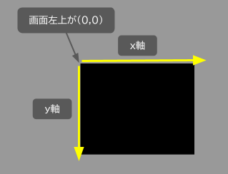
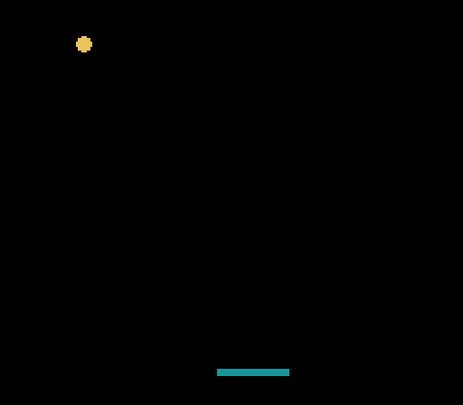
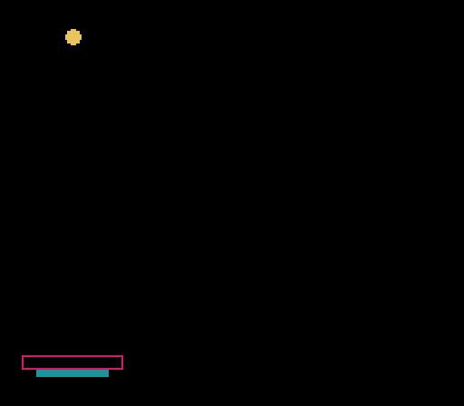
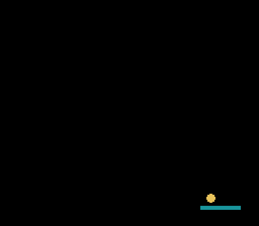

# GameDev Squash  

Pyxelのゲームの処理の流れは基本的に「初期化処理を最初に行い，その後は update() と draw() を実行し続ける」になります。この流れを頭に入れてゲーム作成を行いましょう。  

  

<br>


## ピンポンゲームの作成  

ピンポンゲームはゲーム作成の基本を学習するのに適しています。上記基本の流れ中の「リソースファイルを読み込む」は今回は不要です。

<br>

### 01 ゲーム画面の作成  

下記のコードを入力して実行してください。

squash.py
```python
import pyxel
pyxel.init(120,96)

def update():
    return

def draw():
    pyxel.cls(0)
    return

pyxel.run(update,draw)
```

  

黒い画面が起動できれば成功です。  
画面の横軸 x は右方向に進むと大きくなり，縦軸 y は下方向に進むと大きくなります。  

<br>

### 02 動くボールの作成  

Pyxelのグラフィックス命令でボールを描画します。  
横方向の移動量を ball_xp ，縦方向の移動量を ball_yp として，周囲にぶつかったときに移動量を反転させます。  
pyxel.width，pyxel.height は画面の幅と高さです。  

squash.py
```python
import pyxel
pyxel.init(120,96)

# add
import pyxel
pyxel.init(120,96)

# add *******
ball_x = 40
ball_y = 20
ball_r = 4
ball_xp = 3
ball_yp = 2

def update():
    global ball_x,ball_y,ball_xp,ball_yp

    ball_x += ball_xp
    if ball_x < 0 or pyxel.width - ball_r < ball_x :
        ball_xp = -ball_xp
       
    ball_y += ball_yp
    if ball_y < 0 or pyxel.height - ball_r < ball_y :
        ball_yp = -ball_yp

    return

def draw():
    pyxel.cls(0)

    # add *******
    pyxel.circ(ball_x, ball_y, ball_r, 10)

    return

pyxel.run(update,draw)
```

  

<br>

### 03 マウスに連動してバーを動かす

Pyxelの入力機能を使って，マウスのx座標（pyxel.mouse_x）を取得します。  

squash.py
```python
import pyxel
pyxel.init(120,96)

ball_x = 40
ball_y = 20
ball_r = 4
ball_xp = 3
ball_yp = 2

# add *******
bar_x = 20
bar_y = 80
bar_w = 20
bar_h = 4

def update():
    # add bar_x
    global ball_x,ball_y,ball_xp,ball_yp,bar_x

    ball_x += ball_xp
    if ball_x < 0 or pyxel.width - ball_r < ball_x :
        ball_xp = -ball_xp
       
    ball_y += ball_yp
    if ball_y < 0 or pyxel.height - ball_r < ball_y :
        ball_yp = -ball_yp

    # add *******
    bar_x = pyxel.mouse_x
    if bar_x < 0 :
        bar_x = 0
    elif pyxel.width - bar_w < bar_x :
        bar_x = pyxel.width - bar_w
    
    return

def draw():
    pyxel.cls(0)
    pyxel.circ(ball_x, ball_y, ball_r, 10)

    # add *******
    pyxel.rect(bar_x, bar_y, bar_w, bar_h, 3)

    return

pyxel.run(update,draw)
```

  

<br>

### 04 バーとボールの衝突判定を行う  

下図の赤い枠内にボールの中心が入ったら，ボールのy軸方向の移動量を反転させます。  
  

また，ボールのy座標が画面下に到達した場合は更新処理を止めてGAME OVERの文字を表示させます。

squash.py
```python
import pyxel
pyxel.init(120,96)

ball_x = 40
ball_y = 20
ball_r = 4
ball_xp = 3
ball_yp = 2

bar_x = 20
bar_y = 80
bar_w = 20
bar_h = 4

# add ******
flg = False

def update():
    # add flg
    global ball_x,ball_y,ball_xp,ball_yp,bar_x,flg

    # add ******
    if flg :
        return

    ball_x += ball_xp
    if ball_x < 0 or pyxel.width - ball_r < ball_x :
        ball_xp = -ball_xp
       
    ball_y += ball_yp
    # chg *******
    if ball_y < 0 :
        ball_yp = -ball_yp
    elif pyxel.height - ball_r < ball_y :
        flg = True

    bar_x = pyxel.mouse_x
    if bar_x < 0 :
        bar_x = 0
    elif pyxel.width - bar_w < bar_x :
        bar_x = pyxel.width - bar_w

    # add *******
    if ( bar_x - 4 < ball_x < bar_x + bar_w + 8 ) and ( bar_y - 4 < ball_y < bar_y + 2 ) :
           ball_yp = -2 - pyxel.rndi(0,2)
    
    return

def draw():
    pyxel.cls(0)
    pyxel.circ(ball_x, ball_y, ball_r, 10)
    pyxel.rect(bar_x, bar_y, bar_w, bar_h, 3)

    # add *******
    if flg :
        pyxel.text(42,40, "GAME OVER", 7)
    
    return

pyxel.run(update,draw)
```

 

これでボールを打ち返すゲームが作成できました。  

<br>

[ピンポンゲームのソースコード](../pyxel/squash)  

<br>


## 次のステップ  

ボールを打ち返したときに効果音を再生したい場合は，Pyxelのサウンドエディタを使って音を作ることができます。

Pyxelにはドット絵のエディタも付属しています。ゲームに登場するキャラクターを自由に作成してみましょう。

<br>


[ページの先頭に戻る](#gamedev-squash)　　[TOPに戻る](../README.md#pyxel-game-development)
