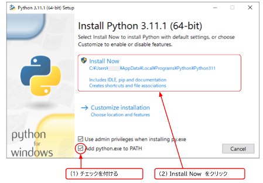

# How to install

PyxelはPython向けのレトロゲームエンジンです。  
Python3（3.7版以降）をインストールしてから，pipコマンドでPyxelをインストールします。  

<br>
  
## Python3 のインストール
    
1.  [python.org](https://www.python.org/) の「Downloads」からPythonのインストーラーを取得する。
2.  インストーラーを起動する。
3.  「Add python.exe to PATH」にチェックを付けてからインストールを実行する。

<br>


  

<br>

## Pyxel のインストール（Windows環境）
  
1.  コマンドプロンプトを起動する。(Windows検索ウィンドウでcmd入力)  
2.   `pip install -U pyxel` を実行する。  
  
<br>  

※  pipコマンドが正常に終了したらインストール完了です。  
```
C:\Users\xxxx>pip install -U pyxel
Collecting pyxel
  Downloading pyxel-1.9.10-cp37-abi3-win_amd64.whl (2.1 MB)
     ---------------------------------------- 2.1/2.1 MB 8.9 MB/s eta 0:00:00
Installing collected packages: pyxel
Successfully installed pyxel-1.9.10

C:\Users\xxxx>
```


<br>


## Windows以外の環境の場合

[Pyxel公式サイト](https://github.com/kitao/pyxel/blob/main/docs/README.ja.md) の インストール方法 を参照してください。  

<br>

[ページの先頭に戻る](#how-to-install)　　[TOPに戻る](../README.md#pyxel-game-development)


