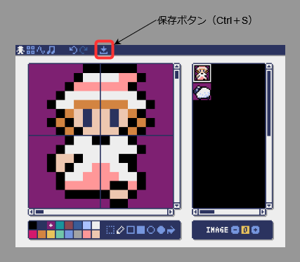
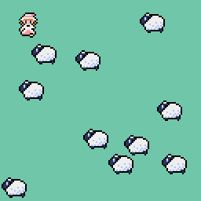
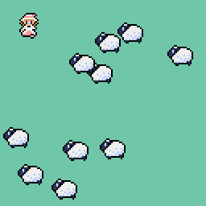
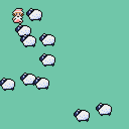

# How to move characters

ドット絵のキャラクターを描いて動かしてみましょう。  


<br>

# 表示するキャラクターの準備

作業フォルダでPyxel付属のエディタを起動しましょう。

```
＞ pyxel edit mygame
```

<br>


  

  

  
ドット絵を描いてエディタの保存ボタンを押すと，起動時に指定したファイル名でリソースファイルが保存されます。（今回は [mygame.pyxres](../pyxel/Sprite/mygame.pyxres) ）  


<br>

# キャラクターを表示するプログラム
リソースファイルは load()命令で読み込みます。  
イメージバンクのドット絵は blt()命令で表示します。  
指定したxy座標にキャラクターを表示する Spriteクラスを作り，draw()メソッド内で blt()命令を実行する例です。  

[sprite01.py](../pyxel/Sprite/sprite01.py)  
``` python
import pyxel
pyxel.init(128, 128)
pyxel.load("mygame.pyxres")

# イメージバンク上のドット絵の座標データ
# Pythonの辞書型（キーと値のペア）を使って取得できるようにした例
# key:[u,v,w,h,透過色]
images = {'bo-peep':[0,0,16,16,2],
          'sheep':[0,16,16,16,2]}

class Sprite:

    def __init__(self,x,y,key):
        self.x = x
        self.y = y
        self.u, self.v, self.w, self.h, self.col = images.get(key,[0,0,8,8,0])

    def draw(self):
        # イメージバンクのドット絵を表示する blt()命令
        pyxel.blt(self.x,self.y, 0, self.u,self.v, self.w, self.h, self.col)
        return

lbp = Sprite(10, 8, 'bo-peep')
sheep = []
for i in range(10):
    x = pyxel.rndi(0,pyxel.width-16)
    y = pyxel.rndi(0,pyxel.height-16)
    sheep.append( Sprite(x,y, 'sheep') )

def update():
    return

def draw():
    pyxel.cls(11)
    lbp.draw()
    for obj in sheep:
        obj.draw()
    
    return

pyxel.run(update, draw)
```
<br>

  

<br>

> __Note__  
クラスを使用したプログラムが難しい人は [ブログ記事 クラスを使う](https://kinutani.hateblo.jp/entry/2023/01/08/171012) を参照してください。  
  

<br>

## キャラクターの移動
Spriteクラスにはxy座標を持たせています。このxy座標が変化すれば画面上をキャラクターが動くことになります。  

[sprite02.py](../pyxel/Sprite/sprite02.py) 抜粋    
``` python
class Sprite:

    def update(self,dx,dy):
        # 横方向の移動
        self.x += dx
        # 画面外に出たとき
        if self.x + self.w <= 0 :
            self.x += pyxel.width + self.w
        elif pyxel.width <= self.x :
            self.x -= pyxel.width + self.w
        
        # 縦方向の移動
        self.y += dy
        # 画面外に出たとき
        if self.y + self.h <= 0 :
            self.y += pyxel.height + self.h
        elif pyxel.height <= self.y :
            self.y -= pyxel.height + self.h   

def update():
    for obj in sheep:
        obj.update(-1,0)
    return
```
<br>

  

<br>

## キャラクターの操作
上下左右方向キーでキャラクターを移動させるには，キー入力に応じてxy座標を変更します。  

[sprite03.py](../pyxel/Sprite/sprite03.py) 抜粋    
``` python
def update():
    # キー入力にあわせてxy方向の移動量を決める
    dx = dy = 0
    speed = 2
    if pyxel.btn(pyxel.KEY_UP) :
        dy -= speed
    if pyxel.btn(pyxel.KEY_DOWN) :
        dy += speed
    if pyxel.btn(pyxel.KEY_LEFT) :
        dx -= speed
    if pyxel.btn(pyxel.KEY_RIGHT) :
        dx += speed
    # キャラクターの移動
    lbp.update(dx,dy)
    
    for obj in sheep:
        obj.update(-1,0)
    return
```
<br>

  

<br>

> __Note__  
Playerクラスを作成して，Playerクラスの update()メソッド内でキーの入力判定を行う作りでも良いでしょう。  

<br>

[ページの先頭に戻る](#how-to-move-characters)　　[TOPに戻る](../README.md#pyxel-game-development)
