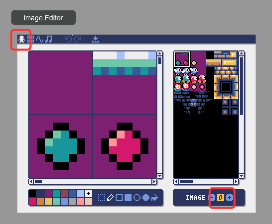
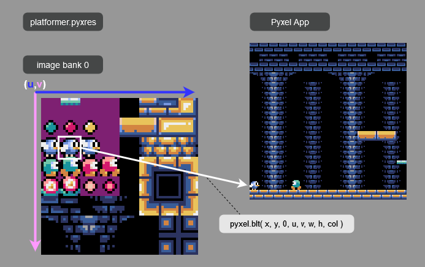
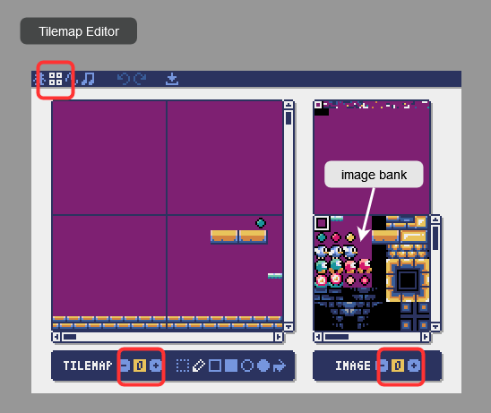
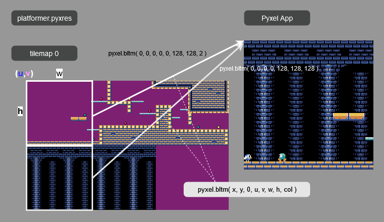
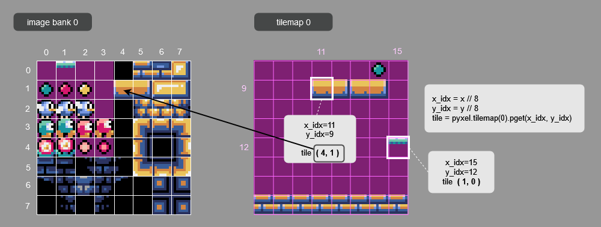

# How to display pixel art

Pyxelアプリケーションでドット絵を表示する方法について説明します。  
覚えてほしいものは「イメージバンク」と「タイルマップ」です。  
公式サンプル「[10_platformer.py](https://github.com/kitao/pyxel/blob/main/python/pyxel/examples/10_platformer.py)」が読み込むリソースファイル「[platformer.pyxres](https://github.com/kitao/pyxel/blob/main/python/pyxel/examples/assets/platformer.pyxres)」の内容を元に説明します。  
  
・サンプルプログラムをコピーしている場合は下記にあります。  
  pyxel_examples/10_platformer.py  
  pyxel_examples/assets/platformer.pyxres  


<br>

## イメージバンク ( image bank )  

イメージバンクには，ドット絵のキャラクターを描いたり，後述のタイルマップの元になるタイル画像を描いたりします。  
Pyxel付属のエディタで platformer.pyxres で開いてみましょう。  

```
＞ cd pyxel_examples/assets/
＞ pyxel edit platformer
```

<br>


  

> __Note__  
エディタ右下の IMAGE 0 が編集中のイメージバンクの番号です。  
イメージバンクは 0-2 の3つがあります。  

<br>

イメージバンクのドット絵をゲーム画面に表示するには，blt()命令を使います。  
`blt(x, y, img, u, v, w, h, [colkey])`  
・表示先の座標（画面上の位置）　x,y  
・絵があるイメージバンクの番号　img 0-2  
・ドット絵の座標（イメージバンク上の位置）　u,v  
・ドット絵の範囲（幅と高さ）　w,h  
・透明色も指定可（色の番号）0-15

  


プログラムの更新処理でキャラクターのxy座標を変化させて，描画処理で指定位置にキャラクターを表示することで，ドット絵を動かすことができます。  


<br>

## タイルマップ ( tilemap )  

2Dゲームで各ステージの地形を表すのに，タイルマップとよばれるものが使われます。  
Pyxelでは画面を構成する単位として8×8ピクセルの画像をタイルと呼んでいます。  

エディタ上部のモード変更ボタンでタイルマップエディタに切り替えます。  
タイルマップエディタでは，タイル画像をスタンプのように編集画面に配置できます。  

<br>

  

> __Note__  
エディタ左下の TILEMAP がタイルマップの番号です。 0-7 の8つがあります。  
エディタ右下の image 0 がタイル画像になるイメージバンクの番号です。切り替えるとタイルマップの見た目が変わります。  

<br>

タイルマップをゲーム画面に表示するには，bltm()命令を使います。  
`bltm(x, y, tm, u, v, w, h, [colkey])`  
・表示先の座標（画面上の位置）　x,y  
・タイルマップの番号　tm 0-7  
・表示するタイルマップ左上の座標　u,v　※ピクセル単位  
・表示するタイルマップの幅と高さ　w,h  
・透明色も指定可（色の番号）0-15 

  


表示するタイルマップの座標を動かすことで，画面をスクロールさせることができます。  


<br>

タイルはイメージバンク上の8ドット区切りのます目状の列と行を示す番号（場所）の情報を持っています。  
この情報をプログラムで調べることで，壁のタイルは通り抜け不可などの判定を行えます。  

  

> __Note__  
tilemap(tm).pget() や pset() の引数には，タイルマップの位置（列,行の番号）を指定します。  
ピクセル単位のxy座標ではないことに注意してください。（例では座標を8で切り捨て除算して算出）  


<br>


[ページの先頭に戻る](#how-to-display-pixel-art)　　[TOPに戻る](../README.md#pyxel-game-development)